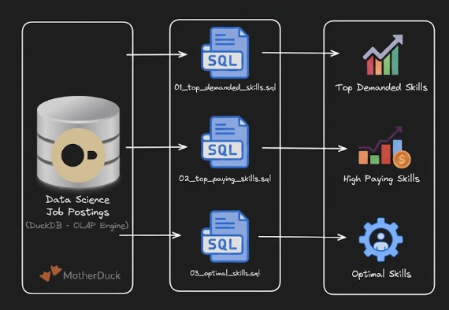

# Exploratory Data Analysis with SQL: Job Market analysis



Analyzed real-world job posting data using production-grade analytical SQL to extract key data engineering market trends. Transformed complex business questions into clear, data-driven insights through optimized queries and efficient data modeling.

## Executive Summary:
- Project Scope: Built 3 optimized analytical queries targetting high-value market questions.

- Data Architecture: Engineered multi-table joins across fact and dimension tables to aggregate complex datasets.

- Core Analytics: Utilized advanced aggregations, precise filtering, and targeted sorting to pinpoint top skills by demand, compensation, and ROI.

- Business Outcomes: Uncovered high-impact trends, including SQL and Python market dominance, top cloud platforms, and compensation benchmarks.

Can be reviewed here: 
- [Top demanded skills](1#EDA\1_Top_demanded_skills.sql) - demand analysis with multi-table joins
- [Highest Paying skills](1#EDA\2_Highest_Paying_Skills.sql) - salary analysis with aggregations
- [Optimal Skills](1#EDA\3_Optimal_skills.sql) -  combined demand/salary optimization query

## Problem and Context
Job market analysts need to answer questions like:

Most in-demand: Which skills are most in-demand for data engineers?
Highest paid: Which skills command the highest salaries?
Best trade-off: What is the optimal skill set balancing demand and compensation?
This project analyzes a data warehouse built using a star schema design. The warehouse structure consists of:

To help job market analysts navigate key industry trends, this project leverages a star-schema data warehouse to address critical market questions:
- High-Demand Skills: Pinpointing the most sought-after technical skills for data engineers.

- Top-Paying Competencies: Identifying the specific tools and frameworks associated with highest compensation.

- High-Value Skill Combinations: Mapping out the optimal balance between market demand and top-tier salary potential.

This project queries a star-schema data warehouse designed to extract insights on skill demand, salary distribution, and optimal skill sets for data engineers:
- Fact Table (`job_postings_fact`): Central fact table storing core job posting metadata, including titles, locations, compensation, and posting dates.

- Dimension Tables:

    - `company_dim`: Stores organizational details linked to individual job postings.

    - `skills_dim`: Contains the skill catalog, categorizing skill names and technical types.

- Bridge Table (`skills_job_dim`): Resolves the many-to-many relationship between job postings and technical skills.

## Tech stack
- Database & Engine: DuckDB (Optimized for high-performance OLAP analytics)
- Query Language: ANSI SQL (Utilizing advanced window and aggregate functions)
- Data Architecture: Star Schema (Fact, Dimension, and Bridge table design)
- Development Environment: VS Code & DuckDB CLI
- Version Control: Git & GitHub

## Repository Structure
```text
1#EDA/
├── 1_Top_demanded_skills.sql
├── 2_Highest_Paying_Skills.sql
├── 3_Optimal_skills.sql
└── README.md
```

## Analysis Overview
### Query Structure
- Top Demanded Skills: Identifies the top 10 most in-demand skills for remote data engineering positions.
- Top Paying Skills: Analyzes the 25 highest-paying skills, surfacing key salary and demand metrics.
- Optimal Skills: Calculates a custom value score—combining the natural log of demand with median salary—to pinpoint high-impact skills to prioritize.

### Key Insights
- Core Languages: SQL and Python lead market demand, appearing in ~29,000 job postings each.
- Cloud Infrastructure: AWS and Azure dominate cloud adoption requirements across modern roles.
- DevOps & Tooling: Containerization and IaC tools (Kubernetes, Docker, Terraform) command premium compensation.
- Big Data Processing: Apache Spark balances high demand with competitive salary benchmarks.

## SQL skills demonstrated
- **Advanced Joins**: Multi-table `INNER JOIN` operations linking `job_postings_fact`, `skills_job_dim`, and `skills_dim`.
- **Aggregations & Grouping**: Categorical analysis using `GROUP BY` paired with `COUNT()`, `MEDIAN()`, and `ROUND()`.
- **Mathematical Modeling**: Log-transformation using `LN()` to normalize high-volume demand metrics before scoring.
- **Filtering & Data Cleaning**:
    - Explicit `NULL` handling (`salary_year_avg IS NOT NULL`).
    - Targeted boolean logic filtering for specific titles and remote roles (`job_work_from_home = TRUE`).
    - Aggregated filtering using `HAVING` to isolate skills with $\ge 100$ postings.
- **Ordering & Output**: Top-N analysis driven by `ORDER BY` and `LIMIT` clauses.